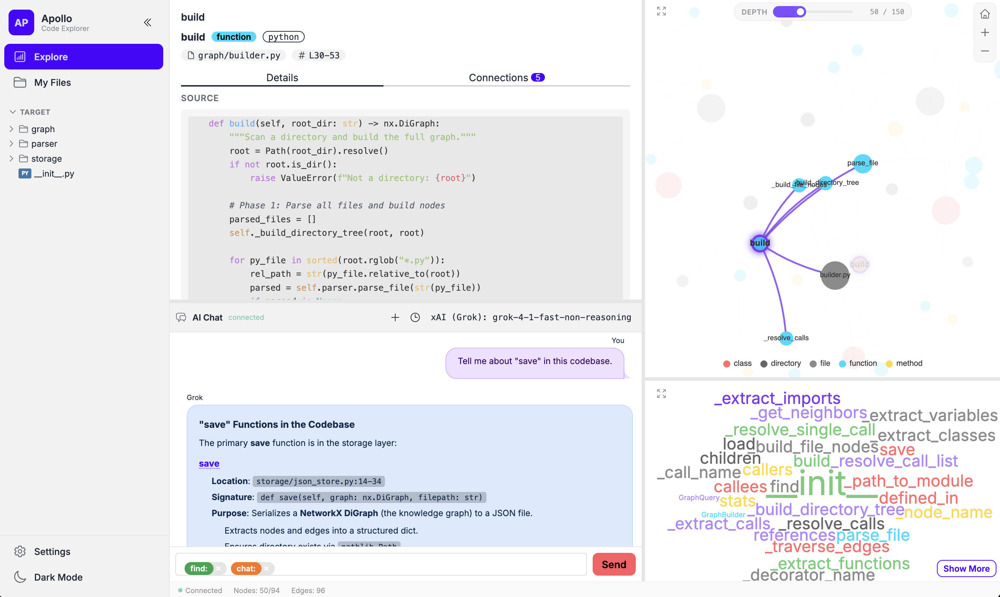

# Apollo




## Who is Apollo?

In Greek mythology, **Apollo** is the god of light, music, poetry, prophecy, and — above all — **wisdom and knowledge**. He illuminates what is hidden and brings clarity to the unseen connections between things.

This project borrows his name because that's exactly what it does for your files. Apollo shines a light on your codebase, notes, and documents, revealing the hidden relationships between them — which functions call which, which notes reference which ideas, which files share concepts — and renders them as an interactive knowledge graph you can **see, explore, and ask questions about**. Whether you're trying to understand a sprawling codebase or rediscover ideas buried in years of notes, Apollo helps you *see and understand* your text and code at a glance.

An **Obsidian-for-your-filesystem** — a browser-based tool that scans any directory, builds a **knowledge graph** of the content and its relationships, and lets you visually explore, search, and ask questions about your files.

Instead of manually linking notes, Apollo **automatically discovers** connections — function calls, imports, shared topics, similar content — and renders them as an interactive, explorable graph. A chat panel powered by the **Grok API** uses tool-calling to query the graph on demand and answer natural-language questions grounded in *your* code and notes.


## Features

- **Code Knowledge Graph** — parses Python via `ast` (rich extraction: params, defaults, type annotations, decorators, docstrings, complexity, LOC, async/nested/test flags, dataclass detection, exception handlers, context managers, framework patterns). Tree-sitter backend available for JS/TS/Go/Rust.
- **Markdown Indexing** — AST-based parsing via `mistune` extracts frontmatter, sections (h1–h6 with hierarchy), code blocks, links, images, tables, and task items as first-class graph nodes.
- **Non-Code Files** — JSON, YAML, CSV, TOML, and plain text indexed as flat documents for full-text embedding and search.
- **Semantic Search** — embeds functions, methods, classes, documents, and sections with `all-MiniLM-L6-v2` (384-dim) and supports cosine-similarity vector search.
- **Spatial Coordinates** — every node gets a computed `(x, y, z)` position encoding conceptual domain (UMAP), structural depth (BFS), and importance (PageRank). Enables spatial range queries, face queries, and spatial walks.
- **Browser UI** — interactive force-directed graph (ECharts), word cloud, source preview panel, sidebar filters, depth slider, and unified chat input.
- **AI Chat (Grok, Tool-Calling)** — Grok decides when to query the graph via 4+ internal tools (`search_graph`, `get_node`, `get_stats`, `get_wordcloud`) plus expanded tools (`search_graph_multi`, `get_neighbors`, `return_result`) and read-only file inspection tools (`file_stats`, `get_file_section`, `get_function_source`, `file_search`, `project_search`). Multi-round tool loops up to 5 rounds.
- **Live File Watching** — incrementally re-indexes on changes. Stat-based prefilter delivers ~261× speedup on no-change runs. Pushes updates via WebSocket.
- **Annotations** — highlights, Markdown notes, and bookmarks anchored to nodes. Soft-delete with trash recovery. Stored in `annotations.json` separately from the index.
- **Web Content Capture** — pull URLs (HTML/PDF) into `_apollo_web/`, convert to Markdown via readability + markdownify (HTML) or Grok summarization (PDF), auto-index into the graph with version history.
- **Dual Storage** — JSON file backend (zero dependencies) or Couchbase Lite with SQL++ queries and native vector search.
- **Indexing Progress UI** — DaisyUI stepper modal polls `/api/indexing-status`, terminal shows 4-step progress with timings.

## Picking a Folder to Explore ("My Files")

Once Apollo is running you don't have to re-launch the server every time you
want to look at a different project. The left nav has a **My Files** button
that lets you point Apollo at any folder on your machine and rebuild the graph
for *that* folder on demand.

1. Click **My Files** in the left nav.
2. The native OS folder picker opens (macOS Finder / Windows Explorer / Linux
   file dialog). Choose the directory you want insights for — a code repo, a
   notes vault, a docs tree, anything with text/code files.
3. Confirm with **Explore this folder**. Apollo scans the directory, parses
   each file, computes embeddings + spatial coordinates, and writes a fresh
   `data/index.json`. The indexing modal shows live progress.
4. When indexing finishes the graph view auto-loads with that folder's nodes
   and edges. The chat panel and search are now scoped to that folder's
   content.

> Folder picking uses the host OS dialog, so it works in the local
> virtualenv setup. When running inside Docker the container can't open a
> native picker — index by mounting the folder into `./target/` instead
> (see [Quick Start](#quick-start)).

## Quick Start

### Local with virtual environment (recommended)

Requires Python 3.9+.

1. **Clone and enter the repo**
    ```bash
    git clone https://github.com/Fujio-Turner/Apollo.git
    cd Apollo
    ```

2. **Create and activate a virtual environment**
   ```bash
   python3 -m venv venv
   source venv/bin/activate          # Windows: venv\Scripts\activate
   ```

3. **Install dependencies**
   ```bash
   pip install -r requirements.txt
   ```

4. **Configure your Grok API key (optional, enables AI chat)**

   Either:
   - Create a `.env` file in the project root:
     ```bash
     echo "XAI_API_KEY=your_key_here" > .env
     ```
   - **Or** skip this step and add the key later from the web UI's
     **Settings** panel (see [Updating the Grok API key](#updating-the-grok-api-key)).

   In both cases the key ends up in `.env` (gitignored) and is loaded
   automatically on startup.

5. **Put the directory you want to index in `./target/`** (or use any path)
   ```bash
   cp -r /path/to/your/project ./target
   ```

6. **Index it**
   ```bash
   python3 main.py index ./target
   ```
   This writes `data/index.json`.

7. **Launch the web UI**
   ```bash
   python3 main.py serve
   ```

8. Open **http://localhost:8080**

When you're done, deactivate the virtualenv with `deactivate`.

### Docker (optional)

If you'd rather not manage a Python environment:

1. Put the directory you want to index in `./target/`:
   ```bash
   cp -r /path/to/your/project ./target
   ```

2. Run:
   ```bash
   docker compose up --build
   ```

3. Open **http://localhost:8080**

To enable AI chat, set your Grok API key:
```bash
XAI_API_KEY=your_key_here docker compose up --build
```

## CLI Reference

```bash
# Index a codebase
python main.py index <directory>
python main.py index <directory> --parser tree-sitter
python main.py index <directory> --incremental
python main.py index <directory> --no-embeddings --no-spatial

# Query the graph
python main.py query <name>
python main.py query <name> --type function --callers --depth 3

# Semantic search
python main.py search "send email notification" --top 10

# Spatial queries
python main.py spatial --near "func::src/mailer.py::emails" --range 30
python main.py spatial --at 90,180 --range 45 --top 20
python main.py spatial --face 1
python main.py spatial-walk "func::src/mailer.py::emails" --step 15 --rings 4

# Inspect a node
python main.py inspect "func::src/mailer.py::emails"

# Watch for live changes
python main.py watch <directory>

# Web UI with live watching
python main.py serve --watch-dir <directory>

# Graph statistics
python main.py status
```

## Architecture

```
┌─────────────────────────────────────────────────────────┐
│                     CLI (main.py)                       │
│   index · query · search · spatial · serve · watch      │
└──────────┬──────────────────────────┬───────────────────┘
           │                          │
   ┌───────▼────────┐        ┌───────▼─────────┐
   │  Parser Layer   │        │  Query Engine    │
   │  AST · Tree-    │        │  structural +    │
   │  sitter ·       │        │  semantic +      │
   │  Markdown ·     │        │  spatial         │
   │  TextFile       │        │                  │
   └───────┬────────┘        └───────┬─────────┘
           │                          │
   ┌───────▼──────────────────────────▼─────────┐
   │              Graph Builder                  │
   │  nodes + edges + embeddings + spatial       │
   │  (single os.walk, fused AST analysis,       │
   │   stat-based incremental prefilter)         │
   └───────────────┬────────────────────────────┘
                   │
   ┌───────────────▼────────────────────────────┐
   │            Storage Backend                  │
   │   JSON Store  ·  Couchbase Lite (SQL++)     │
   └────────────────────────────────────────────┘
```

### Node Types

| Type | ID Pattern | Example |
|------|-----------|---------|
| `directory` | `dir::path` | `dir::src/utils` |
| `file` | `file::path` | `file::src/mailer.py` |
| `function` | `func::path::name` | `func::src/mailer.py::emails` |
| `class` | `class::path::name` | `class::src/mailer.py::MailService` |
| `method` | `method::path::class::name` | `method::src/mailer.py::MailService::send` |
| `variable` | `var::path::name` | `var::src/config.py::SMTP_HOST` |
| `import` | `import::path::module::line` | `import::src/app.py::mailer::L3` |
| `document` | `doc::path` | `doc::README.md` |
| `section` | `section::path::Lline` | `section::README.md::L42` |
| `code_block` | `codeblock::path::Lline` | `codeblock::README.md::L88` |
| `link` | `link::path::Lline` | `link::README.md::L120` |
| `table` | `table::path::Lline` | `table::README.md::L150` |
| `task_item` | `task::path::Lline` | `task::README.md::L200` |
| `comment` | `comment::path::Lline` | TODO/FIXME/NOTE/HACK/XXX |
| `string` | `string::path::Lline` | SQL/URL/regex literals |

### Edge Types

| Type | Meaning |
|------|---------|
| `contains` | directory → file/directory |
| `defines` | file → function/class/variable/document |
| `calls` | function → function (with `call_args`, `call_line`) |
| `imports` | file → import |
| `inherits` | class → base class |
| `references` | function → variable |
| `tests` | test function → tested function |
| `annotates` | highlight/note → node |
| `bookmarks` | bookmark → node/note |

## Spatial Coordinates

Inspired by [3DJSON](https://github.com/househippo/3DJSON) — every node gets a spatial position:

| Axis | Range | Encodes |
|------|-------|---------|
| **X** | 0–360° | Conceptual domain (topic cluster via UMAP on embeddings) |
| **Y** | 0–360° | Structural depth (BFS distance from entry points) |
| **Z** | 0–1.0 | Importance (PageRank centrality) |

Nodes are assigned to one of 6 **faces** based on architectural role: entry points, business logic, data access, utilities, config, and tests.

## AI Chat — Tool-Calling Architecture

Set `XAI_API_KEY` to enable the chat panel. Unlike a traditional RAG pipeline, Grok receives tool definitions and decides when (and what) to query.

```
User question → Grok (with tools) ──┐
                  │                  │
                  ▼                  │
            Tool call?               │
              ├─ Yes → execute → feed result back (up to 5 rounds)
              └─ No  → stream final response
```

### Tools

| Category | Tools |
|----------|-------|
| Discovery | `search_graph`, `search_graph_multi`, `search_source`, `list_files`, `search_by_path` |
| Drill-in | `get_node`, `get_neighbors`, `get_subgraph` |
| Stats | `get_stats`, `get_wordcloud` |
| File inspection (read-only) | `file_stats`, `get_file_section`, `get_function_source`, `file_search`, `project_search` |
| Termination | `return_result` (structured citations: summary + files + node_refs + confidence) |

All file-inspection tools are read-only by design. Paths are sandboxed: every path must resolve to a graph node or fall inside `root_dir`. Optional `expected_md5` returns `409 Conflict` if the file changed since last read.

### Available Models

| Model | Best For |
|-------|----------|
| `grok-4-1-fast-non-reasoning` | Quick Q&A (default) |
| `grok-4-1-fast-reasoning` | Complex analysis |
| `grok-4.20-non-reasoning` | Deep architecture review |

### Unified Chat Input (Phase 12)

The top-bar search and chat box are merged into a single Tagify-powered input with `find:` (green, local graph search) and `chat:` (orange, Grok with tools) badges. Both badges are on by default; remove either to narrow intent.

## Browser UI Highlights

- **Force-directed graph** — ECharts, draggable/zoomable. Disabled animation for 500+ nodes.
- **Depth slider** — 20 logarithmic stops from 5 → 5,000 nodes. Debounced (400ms) reload, 5-min client-side cache.
- **Node count badge + edge count badge + Load button + Delete button** in the dev toolbar.
- **Word cloud** — top 50 entity names (echarts-wordcloud). Click to filter.
- **Source preview panel** — markdown-rendered, with text selection for highlights.
- **Embedded chat panel** — bottom-left, draggable split, DaisyUI bubbles, marked.js + highlight.js for markdown/code.
- **Indexing progress modal** — DaisyUI stepper, polls `/api/indexing-status` every 2s.
- **Annotation tabs** — 📝 Notes, ⭐ Bookmarks, 🌐 Web Captures.
- **Edge cap** — `/api/graph` limits edges to 3× node count to prevent browser freeze.

## REST API & Interactive Docs

Every feature in the Browser UI is built on the same JSON HTTP API that
external clients can call directly. Apollo ships a hand-maintained
[OpenAPI 3.1](https://spec.openapis.org/oas/latest.html) specification at
[`docs/openapi.yaml`](docs/openapi.yaml) covering all **55 endpoints**
(System, Filesystem, Indexing, Reindex, Graph, Search, Files, Projects,
Annotations, Settings, Chat, Images, Watch, Realtime).

Three live views are exposed by the running server:

| URL | What it is |
|---|---|
| **[`/api-docs`](http://localhost:8080/api-docs)** | **Swagger UI rendering of the hand-maintained `docs/openapi.yaml`** — curated descriptions, examples, and reusable schemas. **Start here.** |
| [`/openapi.yaml`](http://localhost:8080/openapi.yaml) | Raw YAML spec served verbatim. Feed this to codegen tools (`openapi-generator`, `swagger-codegen`, etc.) to scaffold typed clients. |
| [`/docs`](http://localhost:8080/docs) and [`/redoc`](http://localhost:8080/redoc) | FastAPI's auto-generated views, derived from the route signatures in `web/server.py`. Useful for spot-checking that runtime behaviour matches the curated spec. |

A markdown quick-reference for the same endpoints lives at
[`docs/API.md`](docs/API.md). The conventions for adding new endpoints —
required tags, OperationIDs, error shapes, schema reuse — are documented
in [`guides/API_OPENAPI.md`](guides/API_OPENAPI.md).

## Configuration

| Environment Variable | Description |
|---------------------|-------------|
| `XAI_API_KEY` | Grok API key for AI chat (optional) |

### Updating the Grok API key

You can manage `XAI_API_KEY` in two equivalent ways — both end up in the
project-root `.env` file (which is gitignored):

1. **Edit `.env` directly**
   ```bash
   echo "XAI_API_KEY=your_key_here" > .env
   ```
   Restart `python3 main.py serve` so the new value is picked up.

2. **Use the web Settings panel**
   - Open the running app at **http://localhost:8080**
   - Open the **Settings** panel
   - Paste your key into the **XAI API Key** field and click **Save Settings**

   The server upserts the value into `.env`, updates the in-process
   environment, and resets the chat client — no restart required.

| CLI Flag | Description |
|----------|-------------|
| `--backend json\|cblite` | Storage backend (default: json) |
| `--parser auto\|ast\|tree-sitter` | Parser backend (default: auto) |
| `--incremental` | Only re-parse changed files (stat-based prefilter) |
| `--no-embeddings` | Skip embedding generation |
| `--no-spatial` | Skip spatial coordinate computation |

## Performance

- **Single filesystem walk** — one `os.walk` pass; directory nodes created lazily.
- **Auto-skip dependency dirs** — `venv/`, `.venv/`, `node_modules/`, `site-packages/`, `target/`, `build/`, `dist/`, `.tox/`, `htmlcov/`, `.idea/`, `.vscode/`, etc. (20+ blocklist + `pyvenv.cfg`/`conda-meta` sentinel detection).
- **No duplicate method extraction** — methods extracted once inside `_extract_classes()`.
- **Fused AST analysis** — single walk per callable for calls + complexity + context managers + exception handlers.
- **Embedding allowlist** — only `function`/`method`/`class`/`document`/`section` nodes ≥40 chars.
- **Stat-based incremental prefilter** — `(mtime_ns, size)` skip; **261× speedup** on no-change incremental runs.
- **Compact JSON** — `separators=(",",":")` streamed to file; 2–4× smaller output.
- **Embedding batch size 256** with `tqdm` progress bar.
- **Non-blocking indexing** — runs in `run_in_executor` so the event loop stays free for status polls.

## Language Plugins

Apollo's language support is **plugin-based**. Each language lives in
its own folder under `plugins/` — drop a new folder in, restart Apollo,
and the new language is supported. No registry to edit, no core code to
change.

```
plugins/
├── python3/         # built-in: Python 3 source files (.py)
├── markdown_gfm/    # built-in: GitHub Flavored Markdown (.md, .markdown)
└── <your_lang>/     # ← drop a new folder here to add a language
    ├── __init__.py  #   exports PLUGIN
    └── parser.py    #   the BaseParser implementation
```

Plugins can:

- Bring their own third-party libraries (lazy-imported, with an
  optional per-plugin `requirements.txt`).
- Self-disable when their dependencies aren't installed.
- Add language-specific extraction (frameworks, decorators, embedded
  SQL, regex patterns, etc.) on top of the standard
  `functions / classes / imports / variables` schema.

➡ **[How to make your own plugin →](guides/making_plugins.md)**

The guide walks through the folder layout, the `BaseParser` contract,
the standard result-dict shape, naming conventions
(`python3/`, `go1/`, `java17/`, `markdown_common/`, `pdf_pypdf/`, …),
how to handle third-party deps, a complete `plugins/go1/` worked
example, and a smoke-test recipe.

## Project Structure

```
apollo/
├── parser/              # Generic parser plumbing (BaseParser, TextFile, Tree-sitter)
├── plugins/             # Language plugins — drop-in folders, one per language
│   ├── python3/         #   Python 3 (AST)
│   └── markdown_gfm/    #   GitHub Flavored Markdown
├── graph/               # Graph builder and query engine
├── storage/             # JSON and Couchbase Lite backends
├── embeddings/          # Sentence-transformer embedding
├── search/              # Semantic and spatial search
├── spatial.py           # Spatial coordinate mapper (UMAP + BFS + PageRank)
├── watcher.py           # File watcher for live updates
├── chat/                # Grok AI chat service (tool-calling)
├── annotations/         # Highlights, notes, bookmarks
├── captures/            # Web content capture pipeline
└── web/
    ├── server.py        # FastAPI backend + WebSocket
    └── static/          # Browser UI (ECharts SPA, DaisyUI, Tagify)
```

## Documentation

- [`docs/DESIGN.md`](docs/DESIGN.md) — full design document with all 14 phases
- [`docs/API.md`](docs/API.md) — REST API quick reference (markdown)
- [`docs/openapi.yaml`](docs/openapi.yaml) — OpenAPI 3.1 specification (machine-readable, source of truth)
- **In-app:** [`/api-docs`](http://localhost:8080/api-docs) — Swagger UI viewer for the spec above (live on the running server)
- [`guides/making_plugins.md`](guides/making_plugins.md) — **how to add a language plugin** (Go, PHP, Java, PDFs, anything)
- [`guides/SCHEMA_DESIGN.md`](guides/SCHEMA_DESIGN.md) — database schema rules
- [`guides/STYLE_HTML_CSS.md`](guides/STYLE_HTML_CSS.md) — HTML/CSS standards
- [`guides/API_OPENAPI.md`](guides/API_OPENAPI.md) — API & OpenAPI maintenance guide

## License

Source code in this repository is licensed under various licenses. The
Business Source License 1.1 (BSL) is one such license. Each file indicates in
a section at the beginning of the file the name of the license that applies to
it. All licenses used in this repository can be found in the top-level
licenses directory.
